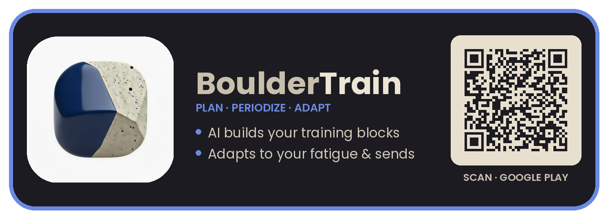
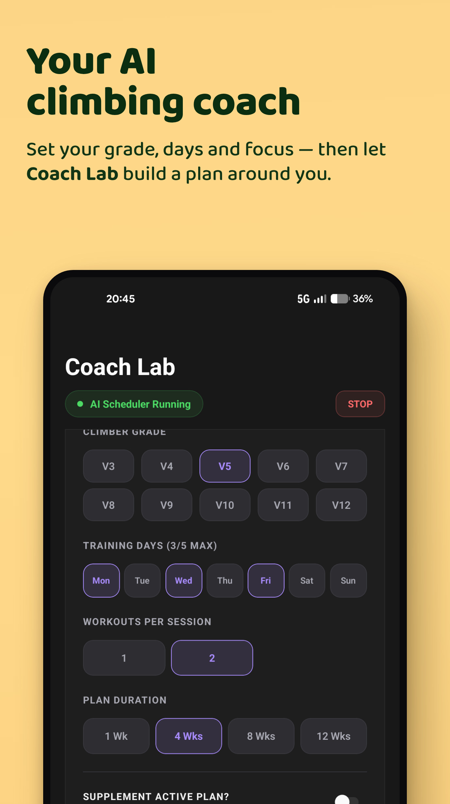
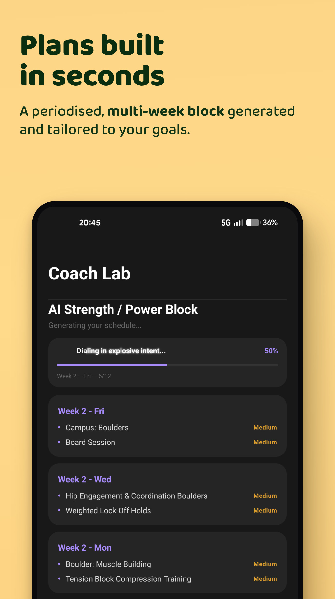
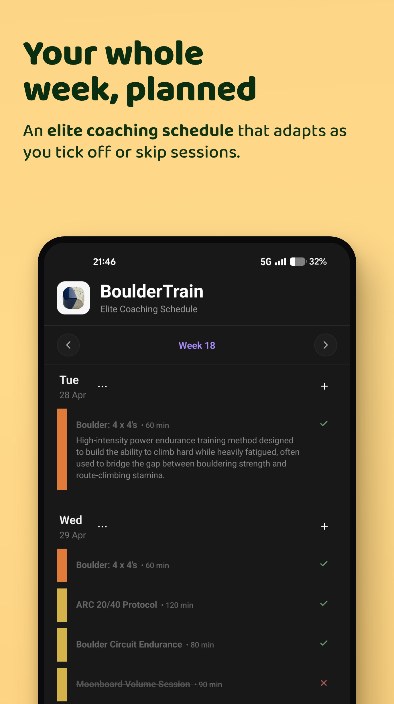
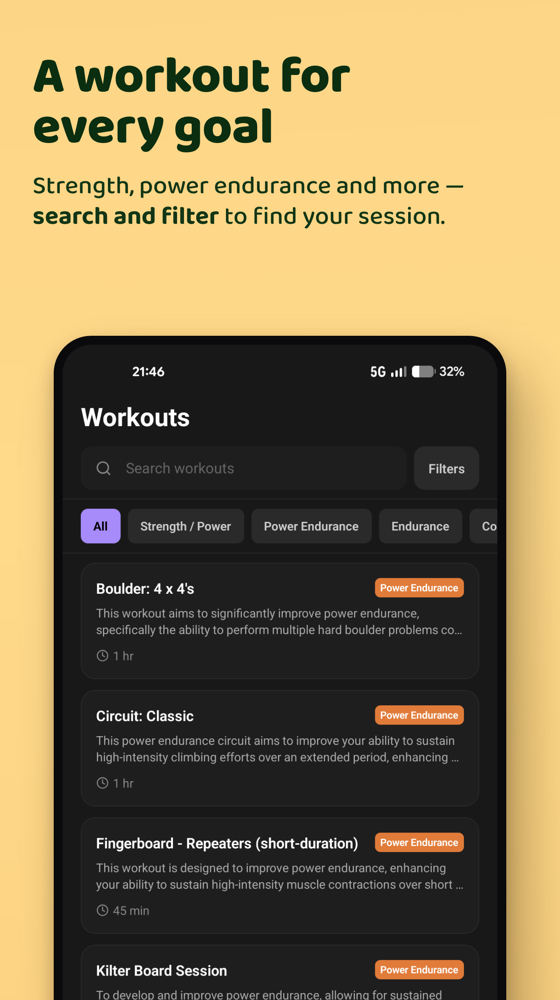
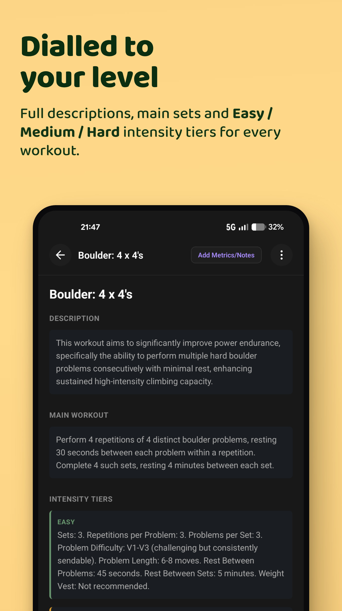
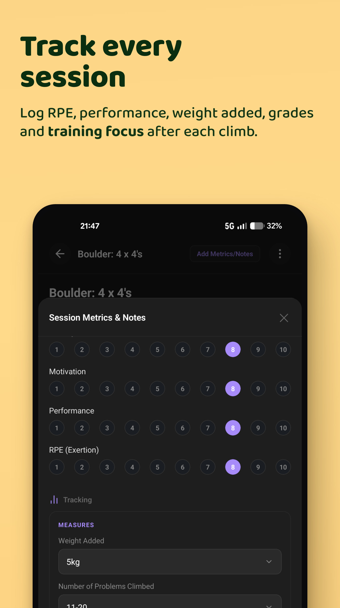

  

<h1 align="center">BoulderTrain</h1>

  <b>The training plan that thinks like a coach &mdash; and changes when you do.</b>

  Most climbers train by guessing. BoulderTrain builds you a proper, periodized plan, 
  fits it around your week, and rewrites it based on how you're <i>actually</i> climbing. 
  No coach. No spreadsheets. No signal required.

  
  &nbsp;
  
  &nbsp;
  

 

  
  
  
  
  

  
  &nbsp;
  
  &nbsp;
  
  &nbsp;
  
  &nbsp;
  

 

## 

<table>
  <tr>
    <td width="50%" valign="top">
      <b>Without a plan</b>  
      &bull; Same three sessions on repeat 
      &bull; Fingers cooked, no idea why 
      &bull; Grade stuck for months 
      &bull; Guessing when to push, when to rest
    </td>
    <td width="50%" valign="top">
      <b>With BoulderTrain</b>  
      &bull; A structured block with a clear purpose 
      &bull; Hard days spaced so you recover 
      &bull; Steady, measurable progression 
      &bull; The app decides &mdash; you just climb
    </td>
  </tr>
</table>

 

## 

<table>
  <tr>
    <td width="33%" valign="top" align="center">
      <h3>1 &middot; Set your goal</h3>
      Your grade, your gear, the days you can train. That's the whole setup &mdash; under a minute.
    </td>
    <td width="33%" valign="top" align="center">
      <h3>2 &middot; Get a real plan</h3>
      A full, multi-week training block lands on your calendar. Session by session, week by week.
    </td>
    <td width="33%" valign="top" align="center">
      <h3>3 &middot; Train &amp; adapt</h3>
      Climb, tick it off, rate how it felt. Your plan learns and reshapes itself around you.
    </td>
  </tr>
</table>

 

##  See it in action

<table align="center">
  <tr>
    <td width="33%"></td>
    <td width="33%"></td>
    <td width="33%"></td>
  </tr>
  <tr>
    <td width="33%"></td>
    <td width="33%"></td>
    <td width="33%"></td>
  </tr>
</table>

 

##  A coach in your pocket

Forget copying a pro's spreadsheet that was never built for you. BoulderTrain designs a structured, multi-week block around **your** grade, **your** equipment and **your** available days. It spaces the hard sessions, keeps the variety high, and never stacks two finger-frying days back to back. You open the app and the only question left is *"ready?"*

And when you want a say in it, one tap steers the whole block &mdash; **Power Bias** for a strength phase, **More Antagonist** to stay balanced, **Protect Fingers** when they're tender, or **Shorter Sessions** for a busy week. Direction without the micromanagement.

 

##  Real periodization, not random workouts

Your plan is built in proper cycles &mdash; progressive **build weeks** that ramp the load, followed by lighter **deload weeks** so you recover and come back stronger. You can always see where you are in the block and what's coming next, so no session is ever "just because." This is how coached athletes train &mdash; now it's automatic.

 

##  It listens to your body

Log how a session went and the plan responds &mdash; quietly, in the background, every week.

<table>
  <tr>
    <td width="50%" valign="top">
      <b>Reads your fatigue</b> 
      Grinding through drained, high-effort sessions? It eases the next ones off before you dig a hole.
    </td>
    <td width="50%" valign="top">
      <b>Protects your fingers</b> 
      Flag a tweak and it dials back max-intensity finger work until you're ready to load again.
    </td>
  </tr>
  <tr>
    <td width="50%" valign="top">
      <b>Fits your real life</b> 
      Always skip Mondays? It stops scheduling the sessions you were never going to do.
    </td>
    <td width="50%" valign="top">
      <b>Grows with you</b> 
      Send a new grade and it raises the ceiling &mdash; so the plan is always one reach ahead.
    </td>
  </tr>
</table>

 

##  A session for every day

**391 dedicated bouldering workouts**, from **V0 warm-ups to V15 projects.** Strength &amp; power, power-endurance, finger strength, core, conditioning, movement and mobility &mdash; ten disciplines in the mix. Got a full board and a hangboard, or just your bodyweight in a bedroom? There's always a session that fits what you've got today &mdash; and if there isn't, **build your own** in seconds, with your drills, your duration and the exact metrics you want to track.

 

##  One workout, three intensities

Every session comes in **Easy**, **Medium** and **Hard** &mdash; each with its own sets, reps, target grades, rest and load. Same workout, right dose: back off when you're cooked, turn the screw when you're flying. Your plan picks the tier to match where you are in the block, and you can always bump it yourself.

 

##  Tell it how it went

A quick post-session check-in captures **RPE, motivation and performance**, plus what actually happened &mdash; problems climbed, max grade, weight added and your training focus. That 15-second tap is the fuel for everything else: it sharpens your stats *and* drives every weekly adjustment the plan makes.

 

##  Progress you can actually see

Every session you log turns into clean, climber-focused stats &mdash; motivation you can scroll.

<table>
  <tr>
    <td width="50%" valign="top">&bull; <b>Grade pyramid</b> &mdash; where your sends really stack up</td>
    <td width="50%" valign="top">&bull; <b>Session heatmap</b> &mdash; your consistency at a glance</td>
  </tr>
  <tr>
    <td width="50%" valign="top">&bull; <b>Strength-to-weight</b> &mdash; power-to-bodyweight, the number that moves grades</td>
    <td width="50%" valign="top">&bull; <b>Weekly volume</b> &mdash; training load over time, so you can see a deload land</td>
  </tr>
  <tr>
    <td width="50%" valign="top">&bull; <b>Training focus</b> &mdash; well-rounded, or secretly one-note?</td>
    <td width="50%" valign="top">&bull; <b>Effort &amp; grade trends</b> &mdash; 30 days, 90 days, a year</td>
  </tr>
  <tr>
    <td width="50%" valign="top">&bull; <b>Plain-English insights</b> &mdash; what your training is telling you</td>
    <td width="50%" valign="top">&bull; <b>Outdoor logbook</b> &mdash; every project and send in one place</td>
  </tr>
</table>

 

##  Yours, and only yours

No account. No sign-up. No cloud. Everything lives on your phone &mdash; so it works in the deepest basement gym with zero signal, and your training data never leaves your pocket. Back everything up to a single JSON file, restore it on a new phone, or export your logbook to CSV &mdash; your data, in your hands, whenever you want.

 

## 

<table>
  <tr>
    <td width="33%" valign="top"><b>AI-built plans</b> Personalized, multi-week training blocks.</td>
    <td width="33%" valign="top"><b>Auto periodization</b> Build and deload weeks, done for you.</td>
    <td width="33%" valign="top"><b>Adapts weekly</b> Reshapes around fatigue, skips &amp; sends.</td>
  </tr>
  <tr>
    <td width="33%" valign="top"><b>Intensity tiers</b> Easy / Medium / Hard on every workout.</td>
    <td width="33%" valign="top"><b>391 workouts</b> V0 to V15, ten disciplines.</td>
    <td width="33%" valign="top"><b>Build your own</b> Custom workouts, custom metrics.</td>
  </tr>
  <tr>
    <td width="33%" valign="top"><b>Fine-tune controls</b> Bias power, protect fingers, go short.</td>
    <td width="33%" valign="top"><b>Deep session logs</b> RPE, focus, grades, weight, notes.</td>
    <td width="33%" valign="top"><b>Deep stats</b> Pyramid, strength-to-weight, trends, insights.</td>
  </tr>
  <tr>
    <td width="33%" valign="top"><b>Outdoor logbook</b> Track every project and send.</td>
    <td width="33%" valign="top"><b>Grades your way</b> V-scale or Font, flip anytime.</td>
    <td width="33%" valign="top"><b>100% offline</b> No account, full backup &amp; export.</td>
  </tr>
</table>

 

## 

<b>Do I need to be advanced?</b> 
No. It scales from V0 to V15 and builds the plan around your current grade &mdash; then grows with you.

<b>Does it need internet?</b> 
Only to install. After that it runs fully offline, so it works anywhere you climb.

<b>Do I have to make an account?</b> 
Never. There's no sign-up and nothing to log into &mdash; your data stays on your phone.

<b>Indoors or outdoors?</b> 
Both. Train indoors on the plan, then log your outdoor projects and sends in the built-in logbook &mdash; grades, style and notes, all in one place.

<b>Can I still train my own way?</b> 
Yes. Follow the plan, swap any session, **build your own workouts**, or just browse the 391-strong library whenever you want.

 

  <b>Plan smarter. Climb harder.</b>

  

